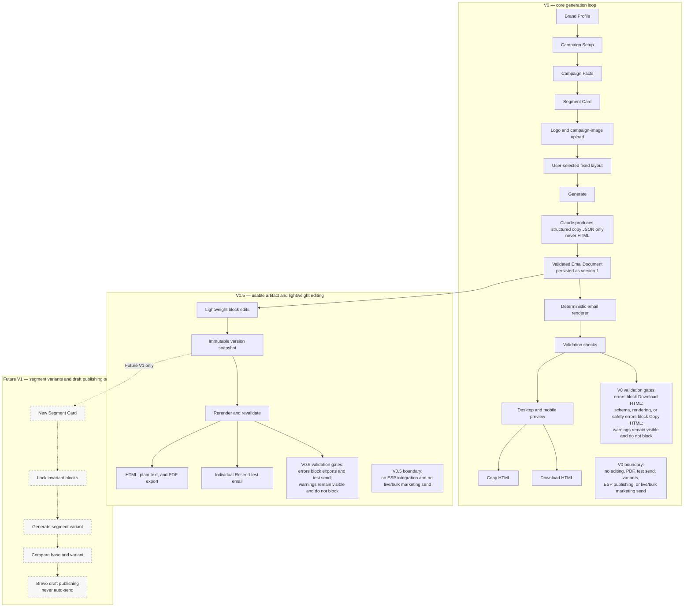
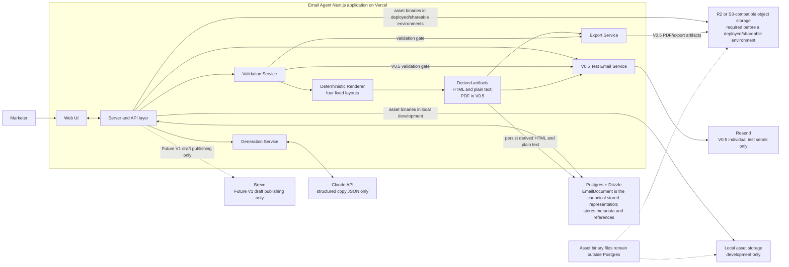
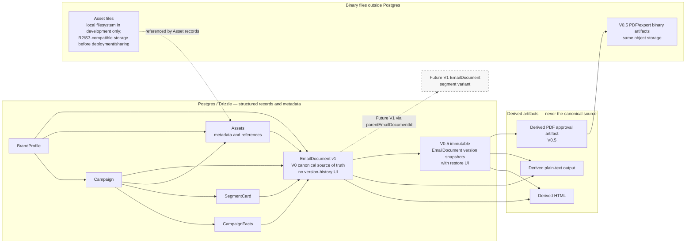
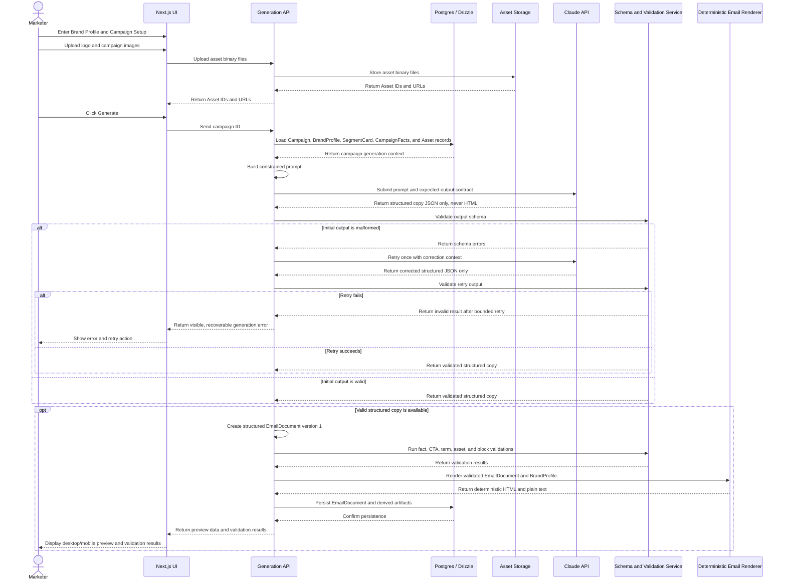

# Email Agent Service — V0 / V0.5 Design Specification

## Product Promise

Turn a campaign brief and approved brand creative into an on-brand, editable, responsive email campaign draft without waiting on a designer.

## Context

Standalone AI campaign-email creation service for lean growth, lifecycle, product-marketing, founder, and agency teams that lack dedicated email design capacity. Not a generic "AI email writer." Not an ESP.

Long-term workflow:

```
Brand Profile + Campaign Brief + Campaign Facts + Audience Segment + Images
  → Structured Base Email (EmailDocument)
  → Editable Email Blocks
  → Segment Variant
  → HTML / PDF / Test Email
  → ESP Draft Publishing
```

Inspired by the category represented by Typeface Email Agent, but with independent UI, brand identity, and scope. Enterprise features (SSO, teams, approval workflows, ESP publishing) are out of V0/V0.5.

**Wedge:** Better brand-kit fidelity than generic ESP AI blocks. V0 exists to test whether deliberate brand-profile application produces output a marketer would refine rather than discard.

**Competitive landscape:** Klaviyo/Mailchimp/HubSpot (AI bolted onto full ESP), Typeface (enterprise, direct reference), Beefree/Unlayer/Stripo/Mailmodo (template builders with some AI), Jasper/Copy.ai (copy-only). Biggest risk: incumbents shipping equivalent brand-aware AI as a feature.

---

## Non-Negotiable Architecture Decisions

See also: [docs/email-agent-decisions.md](../../../docs/email-agent-decisions.md)

1. **No LLM-generated HTML.** The LLM produces validated structured JSON only. The application renders email HTML deterministically from fixed, hand-built templates.
2. **Structured EmailDocument is source of truth.** HTML, plain text, and PDF are derived artifacts. The EmailDocument uses structured blocks and is versionable.
3. **Customer-provided images only.** Logo + 1–3 campaign images. No AI-generated, replaced, or sourced images.
4. **No ESP scope in V0/V0.5.** No Brevo, Klaviyo, SFMC, or any ESP integration. V0.5 adds individual test-email send only.
5. **Do not invent campaign facts.** Dates, pricing, offers, claims, CTA labels, URLs must come from explicit user-confirmed fields. Missing info triggers a warning, never fabrication.
6. **Fixed layout library.** Four layouts: Hero+CTA, Webinar/Event, Text-led Announcement, Promotion/Offer. User chooses. AI may recommend but never silently switch.
7. **Segment Cards, not tags.** Structured card with name, lifecycle stage, motivation, objection, desired action, messaging notes.
8. **Compact UX.** Brand Profile → Campaign Setup → Generate → Preview/Export. Not an enterprise wizard.

## Confirmed Technology Decisions

| Decision | Choice | Notes |
|---|---|---|
| ORM | Drizzle ORM | Hybrid schema: normalize top-level entities (BrandProfile, Campaign, SegmentCard, Asset, EmailDocument); use validated JSONB for CampaignFacts, EmailBlocks, SourceFacts, ValidationResults, model metadata. Do not over-normalize EmailBlock subtypes in V0/V0.5. |
| Test email (V0.5) | Resend | Individual test sends only. No lists, bulk, scheduling. Prefix subjects with `[TEST]`. Record send status + message IDs. Block if validation errors exist. |
| PDF export (V0.5) | Server-side browser rendering (preferred) | Defer specific library choice to export slice. Browser-print fallback acceptable for internal/demo. Do not duplicate layout in separate PDF library. |
| Deployment | Vercel | V0 and V0.5. Managed Postgres selected before external-pilot deployment. No Railway/Render/worker service unless a real requirement emerges (e.g., server-side PDF or durable background jobs). |
| Wireframes | Slice 0 (before any code) | Redesign V0 wireframes as pre-implementation task. V0.5/V1 screens documented as future references only. |

---

## Product Interaction Flow



V0 and V0.5 have no ESP integration and never perform live or bulk marketing sends. Brevo appears only in the Future V1 path for draft publishing.

---

## System Architecture and Container View



HTML, plain text, and the V0.5 PDF approval artifact are derived from the canonical EmailDocument. Postgres stores structured records, artifact fields or references, and asset metadata; it does not store asset binary files.

---

## V0 Scope: Core Generation Loop

### Hypothesis

Given a brand profile, confirmed campaign facts, one target segment, and customer-provided imagery, can the system produce a first email draft that a marketer believes is on-brand and is willing to refine rather than discard?

### V0 Must Include

#### 1. Application Shell
- Single-user, no-auth demo application
- Next.js (React, full-stack), Drizzle ORM, Postgres (managed Postgres selected before external-pilot deployment), deployed on Vercel
- No multi-tenancy, no billing

#### 2. Brand Profile
| Field | Required |
|---|---|
| Brand name | Yes |
| Logo upload | Recommended, not required |
| Primary color (hex) | Yes |
| Secondary color | No |
| Accent color | No |
| Background color | No |
| Text color | No |
| Preferred font (captured, not used in email — safe fallback stack used) | No |
| Email font stack (safe fallback) | Auto-generated |
| Tone/voice preset(s) | Yes (at least one) |
| Free-text voice notes | No |
| Preferred terms | No |
| Prohibited terms | No |
| Default CTA style (filled / outline) | Yes, default: filled |
| Default footer content (or demo footer) | Yes, default provided |

#### 3. Campaign Setup

Uses progressive disclosure. Do not present all fields at once.

**Core fields (always visible):**
| Field | Required |
|---|---|
| Campaign name | Yes |
| Campaign type | Yes |
| Campaign objective | Yes |
| Campaign brief (free text) | Yes |
| CTA label | Yes |
| CTA destination URL | Yes |
| Selected layout (from four fixed layouts) | Yes |
| 1–3 campaign images | Yes (at least 1 for layouts requiring images) |

**Conditional facts (shown based on campaign type):**
| Field | Shown when |
|---|---|
| Product or feature name | feature_launch, announcement |
| Offer/discount/price text | promotion |
| Event date/time | webinar |
| Speaker | webinar |

**Advanced section (collapsed by default, optional):**
| Field | Required |
|---|---|
| Start/end dates | No |
| Eligibility/terms | No |
| Required claims/proof points | No |
| Additional confirmed facts | No |

#### 4. Segment Card
| Field | Required |
|---|---|
| Segment name | Yes |
| Lifecycle stage | No |
| Primary motivation | Yes |
| Primary objection | Yes |
| Desired action | Yes |
| Messaging notes | No |

#### 5. Generation
- One Generate action per campaign
- Server-side Claude API call (Sonnet)
- Input: Brand Profile + Campaign Facts + Segment Card + selected layout + image metadata
- Output: strict structured JSON (no HTML)
- Runtime schema validation on model output
- One bounded retry on malformed output
- Produces: campaign angle, 3 subject-line options, selected subject line, preheader, content for layout blocks, image alt text, assumptions list, missing-input warnings

#### 6. Deterministic Rendering
- Takes validated EmailDocument + BrandProfile
- Renders selected layout into responsive table-based HTML with inline CSS
- Safely escapes AI-generated text
- Validates and sanitizes URLs
- Uses uploaded images with meaningful alt text
- Produces plain-text email as derived artifact
- No freeform model-generated HTML

#### 7. Preview & Export
- Desktop preview (iframe or equivalent)
- Mobile preview
- Subject and preheader visible
- Campaign angle/rationale visible (concise)
- Basic QA/validation panel
- Copy HTML to clipboard
- Download rendered HTML file

#### 8. Validation
| Check | Severity |
|---|---|
| CTA label exists | error |
| CTA URL exists and is valid | error |
| Required layout blocks populated | error |
| All renderer placeholders resolve | error |
| Required image exists for image-required layout | error |
| Image alt text present | warning |
| Footer present | warning |
| Prohibited terms found | warning (V0); V0.5 supports per-term warning vs error |
| Missing campaign fact for selected type | warning |
| Invalid model output state | error |
| HTML rendering error | error |
| Unsafe asset URL | error |

**Validation behavior:**
- **Error-level** results block HTML download, PDF export, and test-email send.
- **Warning-level** results remain visible but do not block any action.
- **Copy HTML** is blocked only by rendering errors, schema errors, or safety errors (e.g., `template_render_error`, `invalid_model_output`, `unsafe_asset_url`) — not by warnings.
- V0 prohibited terms default to warning severity. V0.5 can support configurable warning vs error severity per prohibited term.

#### 9. User-Facing States
- Empty state (no campaigns yet)
- Form validation errors
- Generating / loading
- Generation success → preview
- Generation failure → error message + retry
- No silent fallback to generic copy or different layout

#### 10. Persistence
- Full structured domain model from day one (see Data Model below)
- Drizzle ORM with Postgres; hybrid schema (normalized tables + validated JSONB for nested structures)
- Managed Postgres selected before external-pilot deployment
- Data model is not disposable
- V0 persists BrandProfile, Campaign, SegmentCard, Asset metadata, and generated EmailDocument
- Initial EmailDocument created by generation has version 1
- V0 has no user-facing version-history UI (V0.5 adds immutable version snapshots + restore)
- Asset storage: local filesystem adapter for local development only; Cloudflare R2 or S3-compatible adapter required before any deployed/shareable environment

### V0 Explicitly Excludes
- Authentication, team workspaces, multi-tenancy, billing
- Full WYSIWYG editor, drag-and-drop blocks, arbitrary HTML import
- Segment-variant generation
- ESP integrations (including Brevo), draft publishing
- PDF export, test-email sending
- Live/bulk campaign sending
- Brand website scraping, brand-kit extraction from URL/PDF/Figma
- AI-generated images, stock-image retrieval
- CRM/CDP audience integration, audience/list management
- Deliverability tooling, A/B testing, performance analytics
- Multi-language output, multi-step lifecycle journeys
- External/public agent API, autonomous multi-agent workflows

---

## V0.5 Scope: Usable Artifact and Lightweight Editing

V0.5 starts only after V0 demonstrates generated drafts are sufficiently useful.

### V0.5 Must Include

#### 1. Versioned Persistence
- Persist all entities: BrandProfile, Campaign, CampaignFacts, SegmentCard, Assets, EmailDocument, rendered HTML, plain text, validation results, version history
- Every edit, targeted regeneration, image replacement, or layout switch creates an immutable version snapshot (new EmailDocument row with incremented version number)
- User can browse version history and restore any prior version
- V0 already persists EmailDocument at version 1; V0.5 extends this with multi-version snapshots and restore UI

#### 2. Block-Level Editing
- Edit: subject, preheader, headline, body/supporting copy, CTA label, CTA URL, image alt text
- Replace a campaign image
- No drag-and-drop, no arbitrary layout restructuring

#### 3. Block-Level Regeneration
- Regenerate only: subject lines, preheader, headline, body copy, or CTA
- Preserve user edits in non-targeted blocks
- Do not alter system-owned footer blocks

#### 4. Manual Layout Switching
- Switch among four layouts
- Preserve compatible content where possible
- Warn before dropping incompatible blocks
- Never auto-switch without user confirmation

#### 5. Export
- HTML download
- Plain-text download
- PDF approval export (for review/approval, not a sendable artifact)

#### 6. Test Email
- Send only to manually entered individual test addresses
- No lists, bulk sends, scheduling, recipient targeting
- Must use latest rendered HTML from current EmailDocument
- Blocked if blocking validation errors exist

#### 7. Improved Validation
- Rerun after any edit, layout switch, image replacement, or regeneration
- Show warnings before export or test send
- Persist validation results in version history

#### 8. Usage Instrumentation
Events: `generation_started`, `generation_completed`, `generation_failed`, `preview_viewed`, `html_copied`, `html_downloaded`, `plain_text_downloaded`, `pdf_downloaded`, `test_email_sent`, `block_edited`, `block_regenerated`, `layout_switched`, `version_saved`, `version_restored`

### V0.5 Explicitly Excludes
- Segment-variant generation
- All ESP integrations (including Brevo), draft publishing
- Bulk/scheduled sends, marketing automation
- Full visual WYSIWYG/drag-and-drop editor
- Collaboration/comments/approval workflows
- SSO/audit, performance analytics
- Merge fields, recipient-level personalization
- Automated email-client screenshot testing

---

## Data Model

### Entity Relationships

```
BrandProfile
  └── used by many Campaigns

Campaign
  ├── belongs to one BrandProfile
  ├── uses one SegmentCard (V0/V0.5)
  ├── references campaign Assets
  └── has one EmailDocument at version 1 in V0; immutable additional versions begin in V0.5

EmailDocument
  ├── belongs to one Campaign
  ├── contains versioned structured EmailBlocks
  ├── derives HTML / plain-text / PDF artifacts
  ├── contains SourceFacts and ValidationResults
  └── can reference parentEmailDocumentId for segment variant (V1)

Asset
  ├── stored via pluggable storage adapter (local filesystem for local dev only;
  │   Cloudflare R2 or S3-compatible required before any deployed/shareable environment)
  ├── V0.5 uses same object storage for PDF/export artifacts
  └── referenced by BrandProfile, Campaign, EmailDocument, or export records
```

### Data Lifecycle



### Invariants

1. The LLM must not generate raw HTML.
2. The renderer receives validated EmailDocument + BrandProfile.
3. Every EmailBlock has a stable ID.
4. CTA buttons use CampaignFacts.ctaUrl unless explicitly edited by the user (V0.5).
5. Confirmed CampaignFacts are the source of factual claims.
6. AI-written persuasion is distinct from confirmed factual data.
7. Footer blocks are non-editable and locked for future variants.
8. An EmailDocument with blocking validation errors cannot be exported or test-sent.
9. Future variants inherit immutable campaign facts unless the user explicitly changes them.
10. Asset files are not stored as binary data in Postgres.
11. V0.5 targeted regeneration changes only the requested editable block(s), never unrelated blocks.

### TypeScript Reference Model

```ts
type CampaignType =
  | "announcement"
  | "feature_launch"
  | "webinar"
  | "promotion"
  | "newsletter"
  | "activation"
  | "reactivation";

type CampaignObjective =
  | "clicks"
  | "registrations"
  | "purchase"
  | "activation"
  | "awareness";

type EmailStatus =
  | "draft"
  | "generating"
  | "generated"
  | "needs_review"
  | "approved"
  | "exported"
  | "failed";

type EmailKind = "base" | "segment_variant";

type LayoutId =
  | "hero_cta"
  | "webinar_event"
  | "text_announcement"
  | "promotion_offer";

type LifecycleStage =
  | "prospect"
  | "trial"
  | "new_customer"
  | "active_customer"
  | "lapsed_customer"
  | "vip";

type AssetType = "logo" | "campaign_image" | "reference_image" | "export";

type ValidationSeverity = "info" | "warning" | "error";

type ValidationCode =
  | "missing_cta"
  | "invalid_cta_url"
  | "missing_required_fact"
  | "unsupported_claim"
  | "prohibited_term"
  | "missing_alt_text"
  | "missing_footer"
  | "unresolved_block"
  | "template_render_error"
  | "invalid_model_output"
  | "unsafe_asset_url";

type BrandProfile = {
  id: string;
  name: string;
  logoAssetId?: string;

  colors: {
    primary: string;
    secondary?: string;
    accent?: string;
    background?: string;
    text?: string;
  };

  preferredFont?: string;
  emailFontStack: string;

  tone: string[];
  voiceNotes?: string;
  preferredTerms: string[];
  prohibitedTerms: string[];

  defaultCtaStyle: "filled" | "outline";
  defaultFooterHtml?: string;

  createdAt: string;
  updatedAt: string;
};

type CampaignFacts = {
  productOrFeatureName?: string;

  offerText?: string;
  priceText?: string;
  discountText?: string;
  eligibilityText?: string;
  startDateText?: string;
  endDateText?: string;
  eventDateText?: string;
  eventTimeText?: string;
  speakerText?: string;

  ctaLabel: string;
  ctaUrl: string;

  requiredClaims: string[];
  requiredTerms: string[];
  prohibitedClaims: string[];

  additionalConfirmedFacts?: Record<string, string>;
};

type SegmentCard = {
  id: string;
  name: string;
  lifecycleStage?: LifecycleStage;

  primaryMotivation: string;
  primaryObjection: string;
  desiredAction: string;
  messagingNotes?: string;

  createdAt: string;
  updatedAt: string;
};

type Asset = {
  id: string;
  type: AssetType;

  filename: string;
  mimeType: string;
  sizeBytes: number;

  storageKey: string;
  publicUrl?: string;

  width?: number;
  height?: number;
  altText?: string;

  createdAt: string;
};

type Campaign = {
  id: string;

  brandProfileId: string;
  segmentCardId: string;

  name: string;
  campaignType: CampaignType;
  objective: CampaignObjective;

  brief: string;
  facts: CampaignFacts;

  selectedLayoutId: LayoutId;
  assetIds: string[];

  status: "draft" | "generating" | "generated" | "failed";

  createdAt: string;
  updatedAt: string;
};

type SourceFact = {
  id: string;

  category: string;
  value: string;

  sourceType: "campaign_fact" | "brief" | "brand_profile" | "manual";
  sourceReference?: string;

  approvedForUse: boolean;
};

type TextEmailBlock = {
  id: string;
  type: "headline" | "subheadline" | "text" | "benefits" | "legal_text";

  content: string;

  editable: boolean;
  lockedForVariants: boolean;
};

type ImageEmailBlock = {
  id: string;
  type: "image";

  assetId: string;
  altText: string;

  editable: boolean;
  lockedForVariants: boolean;
};

type ButtonEmailBlock = {
  id: string;
  type: "button";

  label: string;
  href: string;

  editable: boolean;
  lockedForVariants: boolean;
};

type FooterEmailBlock = {
  id: string;
  type: "footer";

  html: string;

  editable: false;
  lockedForVariants: true;
};

type EmailBlock =
  | TextEmailBlock
  | ImageEmailBlock
  | ButtonEmailBlock
  | FooterEmailBlock;

type ValidationResult = {
  id: string;

  severity: ValidationSeverity;
  code: ValidationCode;

  message: string;

  blockId?: string;
  suggestedAction?: string;

  createdAt: string;
};

type EmailDocument = {
  id: string;

  campaignId: string;

  parentEmailDocumentId?: string;

  kind: EmailKind;
  version: number;

  layoutId: LayoutId;

  subject: string;
  preheader: string;

  blocks: EmailBlock[];

  sourceFacts: SourceFact[];
  validationResults: ValidationResult[];

  renderedHtml?: string;
  plainText?: string;
  pdfAssetId?: string;

  status: EmailStatus;

  createdAt: string;
  updatedAt: string;
};
```

---

## LLM Contract

### Generation Service

The generation route receives structured input, calls Claude (Sonnet), and returns structured JSON. No HTML in or out.

#### Input Example

```json
{
  "brandProfile": {
    "name": "Acme Co",
    "colors": { "primary": "#2563EB", "accent": "#F59E0B" },
    "emailFontStack": "Arial, Helvetica, sans-serif",
    "tone": ["confident", "direct"],
    "voiceNotes": "No corporate jargon. Short sentences.",
    "preferredTerms": ["workspace", "team hub"],
    "prohibitedTerms": ["synergy", "leverage"]
  },
  "campaign": {
    "type": "feature_launch",
    "objective": "activation",
    "brief": "Announce the new Shared Workspace feature to active users. Drive feature adoption."
  },
  "facts": {
    "productOrFeatureName": "Shared Workspace",
    "ctaLabel": "Try Shared Workspace",
    "ctaUrl": "https://app.acme.co/workspaces",
    "requiredClaims": ["Real-time collaboration with up to 25 team members"],
    "prohibitedClaims": []
  },
  "segment": {
    "name": "Active power users",
    "lifecycleStage": "active_customer",
    "primaryMotivation": "Work faster with their team",
    "primaryObjection": "Another tool to learn",
    "desiredAction": "Create their first shared workspace"
  },
  "layoutId": "hero_cta",
  "imageSlots": [
    { "slotName": "hero", "assetId": "img_abc123", "altTextHint": "Team using Shared Workspace" }
  ]
}
```

#### Output Example

```json
{
  "campaignAngle": "Position Shared Workspace as reducing context-switching, not adding another tool.",
  "subjectLineOptions": [
    "Your team's new home base is ready",
    "Stop juggling tabs — meet Shared Workspace",
    "Work together, finally in one place"
  ],
  "selectedSubjectLine": "Your team's new home base is ready",
  "preheader": "Shared Workspace brings your team into one real-time space.",
  "blocks": [
    { "slotId": "hero_image", "type": "image", "altText": "Team collaborating in Shared Workspace" },
    { "slotId": "headline", "type": "headline", "content": "Your team's new home base" },
    { "slotId": "body", "type": "text", "content": "Shared Workspace puts your projects, conversations, and files in one place. Real-time collaboration with up to 25 team members — no tab-juggling required." },
    { "slotId": "cta", "type": "button", "label": "Try Shared Workspace", "href": "https://app.acme.co/workspaces" }
  ],
  "assumptions": [
    "Assumed hero image shows team collaboration based on alt-text hint."
  ],
  "missingInputs": [],
  "warnings": []
}
```

#### Model Instructions (system prompt requirements)

The system prompt must instruct the model to:

1. Use only user-confirmed CampaignFacts for prices, dates, offers, eligibility, product details, feature claims, and URLs.
2. Never invent or infer missing commercial/product facts.
3. Return no HTML.
4. Obey prohibited terms and prohibited claims.
5. Respect the selected layout and its available block slots.
6. State missing input rather than guessing.
7. Produce only fields permitted by the expected output schema.
8. Tailor persuasive framing to the SegmentCard's motivation, objection, and desired action.
9. Keep footer content unchanged (system-owned).

#### Runtime Validation

- Validate model output against expected JSON schema before proceeding to rendering.
- On malformed output: retry once with a stricter prompt suffix requesting schema compliance.
- On second failure: return generation error to user with retry action.
- No multi-agent graph or autonomous retry loop.

---

## V0 Generation Sequence



The valid path persists the initial generated EmailDocument as version 1. V0 does not expose version-history controls; immutable version snapshots and restore UI begin in V0.5.

---

## Rendering Model

### Four Fixed Layouts

| Layout ID | Name | Required Blocks | Image Required |
|---|---|---|---|
| `hero_cta` | Hero + CTA | hero_image, headline, body, cta, footer | Yes |
| `webinar_event` | Webinar / Event | headline, event_details, body, cta, footer | No (optional) |
| `text_announcement` | Text-led Announcement | headline, body, cta, footer | No |
| `promotion_offer` | Promotion / Offer | hero_image, headline, offer_details, body, cta, footer | Yes |

### Rendering Rules

1. Each layout is a hand-built, table-based HTML template with inline CSS.
2. Templates use placeholder slots filled from validated EmailDocument blocks.
3. Brand colors applied to background, CTA buttons, headings per BrandProfile.
4. Email font stack uses safe web fallbacks (Arial/Helvetica/Georgia), not custom fonts.
5. Uploaded images are referenced by URL. Local filesystem storage is development-only; an R2/S3-compatible object-storage adapter is required before any deployed/shareable V0 or V0.5 environment. V0.5 uses the same object storage for PDF/export artifacts.
6. All AI-generated text HTML-escaped before insertion.
7. All URLs validated and sanitized (no javascript: or data: schemes).
8. Plain-text version derived by stripping HTML and formatting blocks sequentially.
9. Templates are designed using conservative, table-based HTML and inline CSS for Gmail and Outlook compatibility; verified in the evaluation slice (Slice 6).

---

## User Flow (V0)

```
1. Create or select Brand Profile
   └── Form: name, logo, colors, tone, terms, footer

2. Campaign Setup (single screen, progressive disclosure)
   ├── Core: campaign name, type, objective, brief, CTA label + URL
   ├── Layout selector (4 fixed layouts, with AI recommendation)
   ├── Upload 1–3 images
   ├── Conditional facts (shown by campaign type)
   ├── Advanced section (collapsed: dates, eligibility, claims)
   └── Segment Card (inline form)

3. Generate
   └── Single action → loading state → success or failure

4. Preview & Export
   ├── Desktop / mobile preview toggle
   ├── Subject + preheader display
   ├── Campaign angle (collapsed by default)
   ├── Validation panel
   ├── Copy HTML
   └── Download HTML
```

---

## Testing

### V0 Automated Tests

- Domain model / schema validation tests (all entity types)
- Claude output JSON schema validation tests (valid and malformed inputs)
- Template renderer tests (each layout produces valid HTML and plain text)
- Required-block resolution tests (missing blocks caught)
- HTML/text escaping tests (XSS prevention)
- URL validation/sanitization tests
- All four layouts render non-empty HTML and plain text
- Prohibited-term detection tests
- CampaignFacts presence validation tests

### V0 Manual Evaluation

Fixed evaluation set:
- 3 distinct Brand Profiles (different industries, color schemes, tones)
- 5 campaign briefs (one per campaign type minimum)
- 2 segment types (e.g., new_customer, lapsed_customer)

Manual checks:
- Inspect generated output in browser preview
- Verify brand colors/tone reflected in output
- Confirm no invented facts in output
- Test all four layouts in Gmail (web) and Outlook (desktop) before external demo
- Litmus or similar evaluated later; not a V0 dependency

### V0.5 Automated Tests

- Version creation and restoration
- Block edit persistence (edit saves, non-edited blocks unchanged)
- Targeted regeneration changes only requested block
- Validation reruns after edits
- PDF generation succeeds
- Test send restricted to explicitly entered individual addresses
- Test send / export blocked if blocking validation errors exist
- Instrumentation events fire for tracked actions

---

## Success Criteria

### V0

1. User completes input and sees initial generated preview in under 10 minutes.
2. Generation either succeeds reliably or fails visibly with retry/recovery path.
3. In the evaluation fixture set, the system does not invent unsupported dates, prices, discounts, offers, product facts, claims, or CTA URLs.
4. All four layouts produce non-empty HTML and plain text.
5. Evaluators identify a clear relationship between Brand Profile and generated email's visual/copy choices.
6. User is willing to refine the generated draft rather than discard it immediately.

### V0.5

1. User edits text, CTA, or image and saves/restores a version without regenerating the entire email.
2. User regenerates one specific editable block without unexpected changes to other blocks.
3. User downloads valid HTML, plain text, and a PDF approval artifact.
4. User sends a test email only to an explicitly entered test recipient.
5. Validation reruns and warnings update after each edit, image replacement, layout switch, or regeneration.

---

## Wireframe Alignment

The existing wireframes are visual reference material only and do not fix the final V0 visual direction. The final V0 visual system is approved after Slice 0.

Existing wireframes in `design/v0-ui/`:

| File | Description |
|---|---|
| `Main.dc.html` | 3-step clickable prototype (Direction A: Studio Precision) |
| `DirectionA.dc.html` | Static Brand Kit screen (Direction A) |
| `DirectionB.dc.html` | Static Brand Kit screen (Direction B: Signal) |
| `DirectionC.dc.html` | Static Brand Kit screen (Direction C: Muted Earth) |

### Alignment with V0 Spec

**What aligns:**
- Step 1 (Brand Kit) captures logo, brand colors, font pairing, tone of voice — core Brand Profile fields present.
- Step 2 (Segment & Brief) captures segment selection and campaign brief — maps to Campaign Setup + Segment Card.
- Step 3 (Result) shows self-check verdict, email preview, and Copy HTML — maps to Preview & Export.
- 3-step flow matches the compact UX requirement.

**What's missing from wireframes:**
- Brand Profile is incomplete: no brand name, no primary/secondary/accent/background/text color breakdown, no preferred/prohibited terms, no CTA style default, no footer content.
- Campaign Setup missing: campaign name, campaign type, campaign objective, CTA label, CTA URL, campaign facts fields (offer, dates, pricing, eligibility), layout selection.
- Segment Card is a simple dropdown (3 presets) — needs structured card with motivation, objection, desired action.
- No image upload with slot assignment (wireframe has generic "Upload 1–3 images").
- Preview missing: mobile preview toggle, subject/preheader display, validation panel, download HTML button.
- No empty state, no loading/generating state, no error/failure state shown.

**What implies out-of-scope features:**
- "Self-check passed" verdict card in Step 3 implies V2 agent self-critique loop — V0 shows validation panel instead.
- Color swatch UI suggests a color picker — V0 needs hex input fields with preview swatches.

**Changes needed before coding:**
- Expand Brand Profile form to full field set.
- Replace Step 2 with Campaign Setup screen using progressive disclosure: core fields always visible, conditional facts by campaign type, advanced section collapsed by default. Do not turn V0 into a dense enterprise form.
- Replace segment dropdown with Segment Card form.
- Add layout selector (4 fixed layouts with visual thumbnails).
- Redesign Step 3 as Preview & Export with desktop/mobile toggle, subject/preheader, validation panel, copy + download actions.
- Add empty, loading, error, and retry states.

---

## Future Direction: V1 — Segment Variants (Record Only)

Not in V0 or V0.5. Recorded so V0/V0.5 do not foreclose it.

1. User creates a controlled segment variant from an approved base email.
2. User selects a new Segment Card.
3. User locks invariant content: footer, CTA destination URL, offer details, legal content, optional hero image.
4. Agent shows a "what will change and why" variation plan.
5. Agent regenerates only eligible, non-locked blocks.
6. User compares base and variant side by side.
7. User edits and approves the variant.
8. User exports HTML/PDF or creates a draft in an ESP.
9. Brevo is the leading first ESP candidate: draft-only, never auto-send, user performs final recipient selection and send within the ESP.

The data model supports this via `EmailDocument.parentEmailDocumentId`, `EmailBlock.lockedForVariants`, and `EmailKind = "segment_variant"`. No implementation plan for V1 beyond this note.

---

## Future Direction: V2 — Agent-Native Architecture (Record Only)

Not in V0 or V0.5. Recorded so the build does not foreclose it.

Restructure generation from inline server logic into a standalone callable agent with named identity, system prompt, and stable API contract. V0's web form becomes one caller; the same contract lets external agents (n8n, CRM pipelines) call the service directly. Adds: agent-driven template selection, self-critique loop (bounded, max 2 attempts), incomplete-input handling via agent reasoning, API auth/rate-limiting. Deferred because V0's job is proving output quality, not who calls the service.

## Future Direction: V2 — Brandfetch Integration (Record Only)

Not in V0 or V0.5. User pastes brand URL → auto-populate brand-kit form via Brandfetch or similar API. Deferred because V0's hypothesis does not depend on how the brand kit gets filled in.
